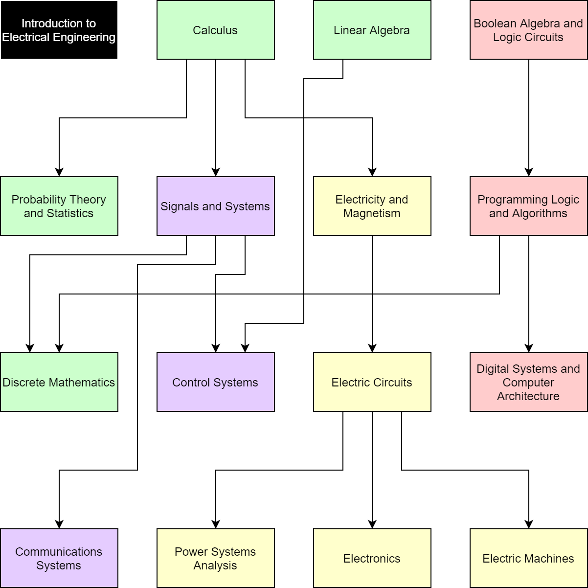

# Open-Source Electrical Engineering Curriculum
This repository consists of a series of online courses and textbook recommendations that together cover most of the basic Electrical Engineering knowledge, similarly to a bachelor's degree.

While I strongly recommend going to an actual university, nowadays we have a wide array of extremely high quality online education resources. Deciding what to study on your own might be difficult when the catalogues are long, and I hope I can at least guide you if you have no idea where to start.

For those of you in the path of obtaining an actual BSEE degree, this might still be useful since it can complement your education.

The curriculum is based on my personal experience completing a BSEE at the Federal University of Rio Grande do Norte, which was a 5 years long programme, but revised to fit into 3 years due to the strong inspiration I got from [ETH Zürich's](https://ee.ethz.ch/studies/bachelor.html) and [MIT's](https://www.eecs.mit.edu/docs/ug/freshman_roadmaps.pdf) curriculums.

Naturally, the actual time you invest highly depends on how many hours a day you put on the online courses and how many of them you want to go through. The textbooks themselves are all good on their own, and valuable resources by themselves if you're good at self-learning.

## Structure
The curriculum is split into 2 parts, a mandatory core and several electives. The core aims to cover the basic knowledge every electrical engineer should know (even if you're not a specialist), opening the doors to the more specific knowledge. Some universities allow you to choose a specialisation, focusing on a single part of EE, which is exactly how the 5th and 6th semesters are designed here.

## Core
The core is divided into 4 knowledge areas:
- **Mathematics**: Calculus, Linear Algebra, Statistics, etc.
- **Electricity**: Electromagnetic Theory, Electric Circuits, Electronics, etc.
- **Computing**: Boolean Algebra, Logic Circuits, Programming, etc.
- **Signals**: Signals and Systems, Control, Communications, etc.

The "Mathematics" subjects are the very first pillars engineers needs to build in order to sustain the rest of our knowledge, you'll need calculus to understand electricity, linear algebra to understand robotics, statistics to understand communications, etc.

The "Electricity" subjects are related to the physical aspects of electromagnetic waves and electronics, which are used in clever ways to build everything else in EE.

The "Computing" subjects cover the logical parts of digital electronics, an area of knowledge that ended up giving birth to IT, CS, CE, etc.

Finally, the "Signals" subjects cover what might be the most unique knowledge in EE, being able to understand what the frequency domain is and how we can design things outside the time-domain. Signals and Systems will lead the way to all knowledge related to control systems, communications systems, computer vision, etc.

## 1st Semester

**Introduction to Electrical Engineering**

I strongly recommend checking YouTube videos about electronics, hardware, software, etc. See if they interest you. Recommending a textbook is extremely difficult since what you want is an overview of what EE is all about, 
but that doesn't mean cool casual books don't exist. Brian Kernighan, the author of the quintessential C language book, wrote something very interesting aimed at people who don't work in the technology field but who'd 
still want to understand the basics of computing and the digital world. It was never meant to be read by engineering students, but it can be a good introduction since it gives you a showcase of many concepts without delving 
too deep into technical details.

Recommended book:  
[Understanding the Digital World - Brian Kernighan](https://www.amazon.com/Understanding-Digital-World-Computers-Internet/dp/069117654X)

Trustworthy resources:  
[AnandTech](www.anandtech.com)  
[EEVblog](https://www.youtube.com/user/EEVblog/videos)  
[ElectroBOOM](https://www.youtube.com/user/msadaghd/videos)  
[Computerphile](https://www.youtube.com/user/Computerphile/videos)  

**Calculus**

Recommended textbooks:  
[Calculus - Gilbert Strang](https://ocw.mit.edu/resources/res-18-001-calculus-online-textbook-spring-2005/textbook/)

Trustworthy resources:  
[Calculus 1A - Differentiation](https://www.edx.org/course/calculus-1a-differentiation-2)  
[Calculus 1B - Integration](https://www.edx.org/course/calculus-1b-integration-2)  
[Calculus 1C - Coordinate Systems and Infinite Series](https://www.edx.org/course/calculus-1c-coordinate-systems-infinite-series-2)  

**Linear Algebra**

Recommended textbook:  
[Linear Algebra - Gilbert Strang](https://math.mit.edu/~gs/linearalgebra/)  
[Linear Algebra Applications - Steve Leon](https://www.amazon.com/Linear-Algebra-Applications-Steve-Leon/dp/0136009298)

Trustworthy resources:  
[Introduction to Linear Models and Matrix Algebra](https://www.edx.org/course/introduction-to-linear-models-and-matrix-algebra-3)  
[Linear Algebra: Foundations to Frontiers](https://www.edx.org/course/linear-algebra-foundations-to-frontiers-3)  
[Differential Equations: Linear Algebra and NxN Systems of Differential Equations](https://www.edx.org/course/differential-equations-linear-algebra-and-nxn-systems-of-differential-equations-2)  

**Boolean Algebra and Logic Circuits**

Recommended textbooks:  
[Digital Design - Frank Vahid](https://www.amazon.com/Digital-Design-Frank-Vahid/dp/0470044373)  
[Digital Design RTL VHDL Verilog - Frank Vahid](https://www.amazon.com/Digital-Design-RTL-VHDL-Verilog/dp/0470531088)

Trustworthy resources:  
[Computation Structures Part 1: Digital Circuits](https://www.edx.org/course/computation-structures-part-1-digital-circuits)

## 2nd Semester

**Probability Theory and Statistics**

Recommended textbooks:  
[All of Statistics: A Concise Course in Statistical Inference - Larry Wasserman](https://www.amazon.com/All-Statistics-Concise-Statistical-Inference/dp/0387402721)  
[Grinstead and Snell’s Introduction to Probability](https://math.dartmouth.edu/~prob/prob/prob.pdf)

Trustworthy resources:  
[Fundamentals of Statistics](https://www.edx.org/course/fundamentals-of-statistics-3)  
[Statistics](https://www.edx.org/course/mathtrackx-statistics)  
[Probability](https://www.edx.org/course/mathtrackx-probability)  
[Statistics and R](https://www.edx.org/course/statistics-and-r-3)  

**Electricity and Magnetism**

Recommended textbooks:  
[Electromagnetic Field Theory - Markus Zahn](https://ocw.mit.edu/resources/res-6-002-electromagnetic-field-theory-a-problem-solving-approach-spring-2008/textbook-contents/)

Trustworthy resources:  
[Electricity and Magnetism Part 1](https://www.edx.org/course/electricity-and-magnetism-part-1)  
[Electricity and Magnetism Part 2](https://www.edx.org/course/electricity-magnetism-part-2)  
[Electricity and Magnetism: Electrostatics](https://www.edx.org/course/electricity-and-magnetism-electrostatics)  
[Electricity and Magnetism: Fields and Forces](https://www.edx.org/course/electricity-and-magnetism-magnetic-fields-and-forc)  
[Electricity and Magnetism: Maxwell Equations](https://www.edx.org/course/electricity-and-magnetism-maxwells-equations)  

**Programming Logic and Algorithms**

Recommended textbooks:  
[C Programming Language - Brian W. Kernighan, Dennis M. Ritchie](https://www.amazon.com/Programming-Language-2nd-Brian-Kernighan/dp/0131103628)  
[C Programming A Modern Approach - K. N. King](https://www.amazon.com/C-Programming-Modern-Approach-2nd/dp/0393979504)

Trustworthy resources:  
[Introduction to Computer Science](https://cs50.harvard.edu/x/2020/)  
[Introduction to Computer Science and Programming](https://www.edx.org/course/introduction-to-computer-science-and-programming-7)  
[Basics of Computing and Programming](https://www.edx.org/course/basics-of-computing-and-programming)  

**Linear Systems and Signals**

Recommended textbooks:  
[Linear Systems and Signals - Lathi](https://www.amazon.com/Linear-Systems-Signals-2nd-Lathi/dp/0195158334)  
[Signals and Systems - Alan V. Oppenheim, Alan S. Willsky, with S. Hamid](https://www.amazon.com/Signals-Systems-2nd-Alan-Oppenheim/dp/0138147574/)  
[Discrete-Time Signal Processing - Alan V. Oppenheim, Ronald W. Schafer](https://www.amazon.com/Discrete-Time-Signal-Processing-3rd-Prentice-Hall/dp/0131988425)

Trustworthy resources:  
[Signals and Systems Part 1](https://www.edx.org/course/signals-and-systems-part-1)  
[Signals and Systems Part 2](https://www.edx.org/course/signals-and-systems-part-2)  
[Differential Equations: Fourier Series and Partial Differential Equations](https://www.edx.org/course/differential-equations-fourier-series-and-partial)  
[Discrete Time Signals and Systems Part 1: Time Domain](https://www.edx.org/course/discrete-time-signals-and-systems-part-1-time-do-2)  
[Discrete Time Signals and Systems Part 2: Frequency Domain](https://www.edx.org/course/discrete-time-signals-and-systems-part-2-frequency)  
[Discrete Time Signal Processing](https://www.edx.org/course/discrete-time-signal-processing-4)

## 3rd Semester

**Discrete Mathematics**

Trustworthy resources:  
[Mathematical Modelling Basics](https://www.edx.org/course/mathematical-modelling-basics)  
[Computational Thinking for Modelling and Simulation](https://www.edx.org/course/computational-thinking-for-modeling-and-simulation)  
[Introduction to Programming with MATLAB](https://www.coursera.org/learn/matlab)  

**Electric Circuits**

Recommended textbooks:  
[Fundamentals of Electric Circuits - Matthew Sadiku](https://www.amazon.com/Fundamentals-Electric-Circuits-Charles-Alexander/dp/0078028221)  

Trustworthy resources:  
[Circuits and Electronics 1: Basic Circuit Analysis](https://www.edx.org/course/circuits-and-electronics-1-basic-circuit-analysis)  

**Digital Systems and Computer Architecture**

Recommended textbooks:  
[Computer Architecture A Quantitative Approach - David A Patterson and John L. Hennessy](https://www.amazon.com/Computer-Architecture-Quantitative-John-Hennessy/dp/012383872X)  
[Computer Organization and Design RISC-V Edition: The Hardware Software Interface - David A Patterson and John L. Hennessy](https://www.amazon.com/Computer-Organization-Design-RISC-V-Architecture-ebook/dp/B0714LM21Z/)  
[Digital Design and Computer Architecture - Harris and Harris](https://www.amazon.com/Digital-Design-Computer-Architecture-Harris/dp/0123944244)  
[Digital Systems, Global Edition - Tocci](https://www.amazon.com/Digital-Systems-Ronald-Tocci-ebook/dp/B01DV7565C)  
[Digital Design RTL VHDL Verilog - Frank Vahid](https://www.amazon.com/Digital-Design-RTL-VHDL-Verilog/dp/0470531088)  
[Logic & Computer Design Fundamentals - M. Morris R. Mano, Charles R. Kime, Tom Martin](https://www.amazon.com/Logic-Computer-Design-Fundamentals-5th/dp/0133760634)  

Trustworthy resources:  
[Nand2Tetris Part 1](https://www.coursera.org/learn/build-a-computer)  
[Nand2Tetris Part 2](https://www.coursera.org/learn/nand2tetris2)  
[Computation Structures 2: Computer Architecture](https://www.edx.org/course/computation-structures-2-computer-mitx-6-004-2x)  
[Computation Structures 3: Computer Organization](https://www.edx.org/course/computation-structures-3-computer-mitx-6-004-3x-0)  

**Control Systems**

Recommended textbooks:  
[Control Systems Engineering - Norman Nise](https://www.amazon.com/Control-Systems-Engineering-Norman-Nise/dp/0470917695)  
[Modern Control Systems - Richard C. Dorf](https://www.amazon.com/Modern-Control-Systems-13th-Richard/dp/0134407628)  

Trustworthy resources:  
[Introduction to Control System Design - A First Look](https://www.edx.org/course/introduction-to-control-system-design-a-first-look)  
[Dynamics and Control](https://www.edx.org/course/dynamics-and-control)  
[Introduction to State Space Control](https://www.edx.org/course/introduction-to-state-space-control)

## 4th Semester

**Power Systems Analysis**

Recommended textbooks:  
[Power System Analysis - Hadi Sadaat](https://www.amazon.com/Power-System-Analysis-Third-Saadat/dp/0984543864)

**Electric Machines**

Recommended textbooks:  
[Fitzgerald & Kingsley's Electric Machinery](https://www.amazon.com/Fitzgerald-Kingsleys-Electric-Machinery-Stephen/dp/0073380466)

**Electronics**

Recommended textbooks:  
[Microelectronic Circuits - Sedra](https://www.amazon.com/Microelectronic-Circuits-Electrical-Computer-Engineering/dp/0190853549)  
[Microelectronics - Razavi](https://www.amazon.com/Microelectronics-2Nd-Behzad-Razavi/dp/8126571357)  
[Electronic Principles - Malvino](https://www.amazon.com/Electronic-Principles-Albert-Malvino/dp/0073373885)

Trustworthy resources:  
[Circuits and Electronics 2: Amplification, Speed, and Delay](https://www.edx.org/course/circuits-and-electronics-2-amplification-speed-and-delay)  
[Circuits and Electronics 3: Applications](https://www.edx.org/course/circuits-and-electronics-3-applications)  
[Principle of Semiconductor Devices Part I: Semiconductors, PN Junctions and Bipolar Junction Transistors](https://www.edx.org/course/principle-of-semiconductor-devices-part-i-semicond)  
[Principle of Semiconductor Devices Part II: Field Effect Transistors and MOSFETs](https://www.edx.org/course/principle-of-semiconductor-devices-part-ii-field-e)  

**Communication Systems**

Recommended textbooks:  
[Modern Digital and Analog Communication - Lathi](https://www.amazon.com/Digital-Communication-Electrical-Computer-Engineering/dp/0190686847)

Trustworthy resources:  
[A System View of Communications: From Signals to Packets (Part 1)](https://www.edx.org/course/a-system-view-of-communications-from-signals-to-pa)  
[A System View of Communications: From Signals to Packets (Part 2)](https://www.edx.org/course/a-system-view-of-communications-from-signals-to-2)  
[A System View of Communications: From Signals to Packets (Part 3)](https://www.edx.org/course/a-system-view-of-communications-from-signals-to-3)  
[IoT Networks and Protocols](https://www.edx.org/course/iot-networks-and-protocols)

## 5th and 6th Semesters
This is where the core principles of Electrical Engineering are completely covered. The student should freely choose the remaining subjects based on personal interests and the preferred knowledge area. I won't bother specifying specific courses since by now you're probably used to edx and coursera.

**Power Systems Subjects**  
Power Systems II  
Power Substations  
Power Protection  

**Electronics Subjects**  
Power Electronics  
Nanoelectronics  
RF Electronics  
Electromagnetic Compatibility  
Semiconductor Physics  
Optoelectronics  

**Digital Electronics Subjects**  
VLSI Design  
Functional Verification  
Design For Testing  
Embedded Systems  

**Computing Subjects**    
Operating Systems  
Machine Learning  
Computer Vision  
Computer Networks  

**Control Subjects**  
Adaptive Control  
Non-Linear Systems  

**Communications Subjects**  
Digital Signal Processing  
Advanced Compression and Coding  
Antennas  
Optical Communications  
Wireless Communications  

## Prerequisites

The following image illustrates the "flow" in which subjects should be studied in order to facilitate them.

